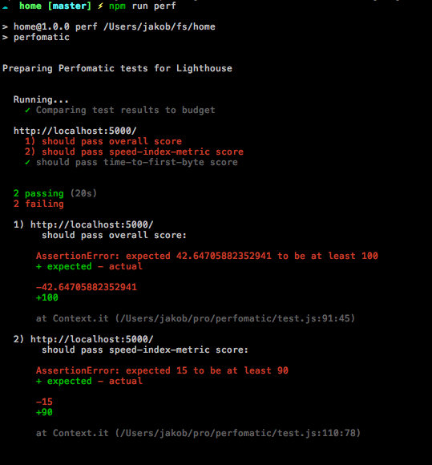

# Perfomatic

Run Lighthouse performance tests easily from your app



# Install

From your app's root:

```
npm install perfomatic --save-dev
```

Add a simple perfomatic config to your package.json

```JSON
"perfomatic": {
  "urls": [
    "http://localhost:5000"
  ],
  "overall": 95,
  "budget": {
    "speed-index-metric": 90,
    "time-to-first-byte": true
  }
}
```

Make an npm script for it

```JSON
"scripts": {
  "perf": "perfomatic"
}
```

*START UP YOUR SERVER* at the urls you want to test against, then run perfomatic:

```
npm run perf
```

OR

# Sample vscode debugger setup (put this in your app to run with F5 debugger)

```JSON
{
  // Use IntelliSense to learn about possible attributes.
  // Hover to view descriptions of existing attributes.
  // For more information, visit: https://go.microsoft.com/fwlink/?linkid=830387
  "version": "0.2.0",
  "configurations": [
    {
      "type": "node",
      "request": "launch",
      "name": "Perfomatic Tests",
      "stopOnEntry": false,
      "program": "${workspaceFolder}/node_modules/mocha/bin/_mocha",
      "args": ["--no-timeouts", "--colors", "${workspaceFolder}/node_modules/perfomatic/test.js"],
      "internalConsoleOptions": "openOnSessionStart"
    }
  ]
}
```

# All available package.json config options

```JSON
"perfomatic": {
  "urls": [
    "http://localhost:5000"
  ],
  "verbose": true, // show metric output, and HELP feedback about failed metrics
  "showAvailableMetrics": true, // print current available metrics and scoring types, binary or numeric
  "overall": 90,
  "budget": {
    "speed-index-metric": 90, // numeric (0-100, higher is better)
    "time-to-first-byte": true, // binary (false)
    ... // all the other metrics
    }
  }
}
```
